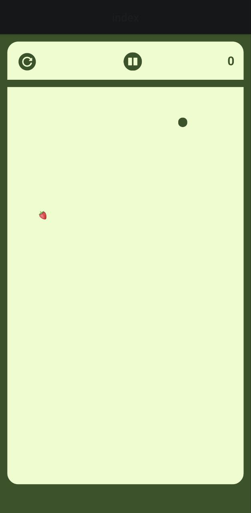
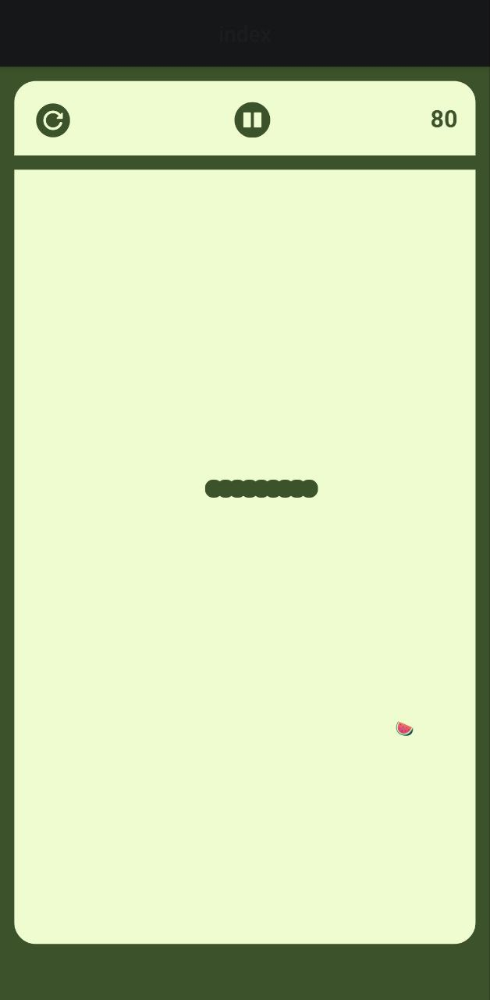
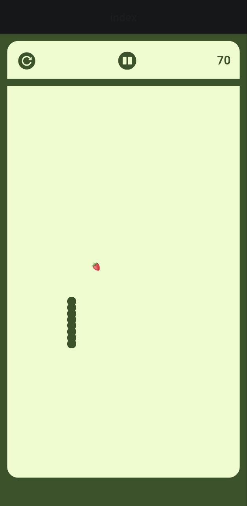
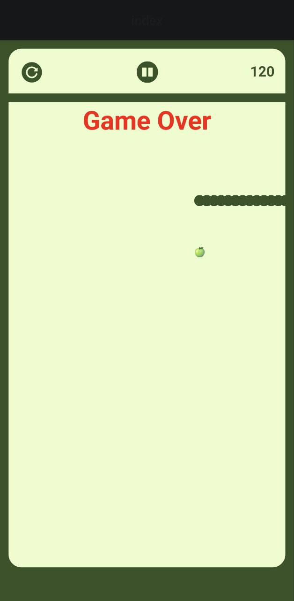
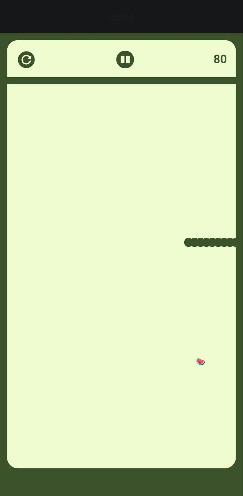
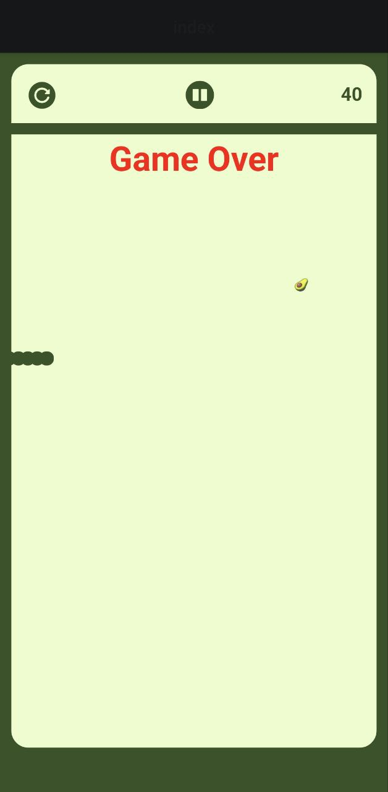

# Snake Game React Native Expo

A snake game made with [React Native](https://reactnative.dev/), [Typescript](https://www.typescriptlang.org/) and React Native Gestures.

[](https://giphy.com/gifs/oaqiOae89XJ5WYJcbE)


## :star: Features

- Bare React Native Expo App
- React Native Typescript Template
- Play, Pause and Rset game
- Length of snake increase when eat food
- Game over if touched the boundary
- Scrore increase when eat food
- get new food each time app loads

## ⚒️ Tech stack

- [React Native](https://reactnative.dev/)
- [Typescript](https://www.typescriptlang.org/)
  - [help](https://react-typescript-cheatsheet.netlify.app/)
- React Native Gestures

## :star: Get Started

### React Native Setup

make sure to have setup development environment

[📍 Setting up the development environment](https://reactnative.dev/docs/environment-setup)

```bash
# clone
git clone https://github.com/sketchomania/snake_game_react_native.git
```

```bash
# install dependencies
npm install

# Or use `yarn`
yarn install
```


Run project

```bash
# run project
npx expo start
```

### Screenshot

<div style="display: flex; margin: 1rem; justify-content: space-around; flex-wrap: wrap">
 
 
 
</div>
<div style="display: flex; margin: 1rem; justify-content: space-around; flex-wrap: wrap">
 
 
 
</div>

## 🚀 Contribute

Contributions are most welcome in this project be it reporting an issue or sending a pull request.

Some of the things you could help with currently are -

1. Improvements
   - make visible bounday collaps more accurate

2. Adding features
   - You can add useThemes()
   - Show animation of game over
   - Snake face can be added
